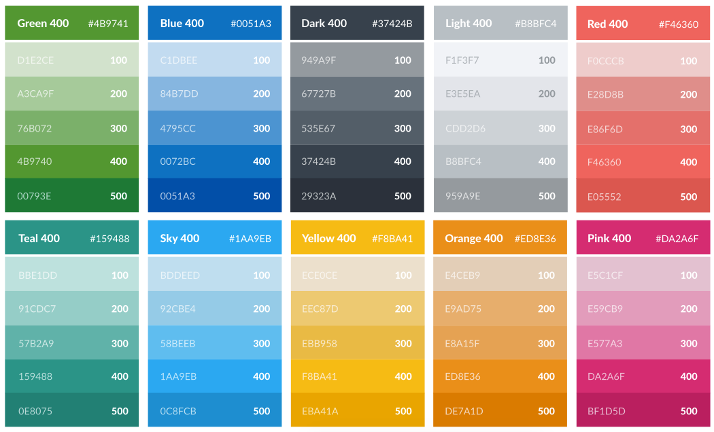

Quizzes
=======
Quizzes is a tool for teachers to create assessments and for students to play those assessments and get a score.

## Introduction
Quizzes is not a replacement for Gooru or any other LMS, it is a tool that will provide new functionality and in other cases, will increase the capabilities of existing functionality. Quizzes is not intended to manage school, classroom or student information and it does not depend on a specific LMS context to work.

## Prerequisites

See [Environment Setup](./docs/environment-setup.md)

* [Git](http://git-scm.com/)
* [Node.js](http://nodejs.org/) (with NPM)
* [Bower](http://bower.io/)
* [Ember CLI](http://www.ember-cli.com/)
* [PhantomJS](http://phantomjs.org/)
* [Grunt-CLI](https://github.com/gruntjs/grunt-cli)
* [Stubby](https://github.com/mrak/stubby4node)

## High Level Architecture
This project is built on top of EmberJS 2.x and Ember CLI

#### Technology stack
* Ember CLI
* Ember 2.x
* Ember Simple Auth
* Ember i18n
* Handlebars
* SASS
* Bootstrap
* jQuery
* Grunt
* Stubby

#### Project Structure
This project follows the project structure suggested by Ember CLI

#### Communication Layer - Custom Adapters and Serializers
EmberJS 2.x implements by default json:api specification for REST communication, custom EmberJS adapters and serializers are necessary to communitate and match the current Gooru's API end points convention. 

#### API-SDK Layer
The SDK layer is defined with intention to create an abstraction layer or abstraction level to hide the implementation details of the use of Ember Data. As part of this idea is to encapsulate the use of Ember Data in order to avoid as much as possible the use of Ember Data everywhere in code, so we can have a single entrance point to communicate with Gooru's API end-points.

#### Authentication and Authorization
The library ember-simple-auth is used for authentication and authorization, it also track the user client session. See [Ember Simple Auth](http://ember-simple-auth.com/)

#### Internationalization
The library ember-i18n is used for internationalization, it is fully integrated with Ember-CLI. 

See [ember-i18n](https://github.com/jamesarosen/ember-i18n/wiki)

#### Application Logger
 Ember.Logger is used for logging application messages.
 
 See 
 * [Ember Logger](http://emberjs.com/api/classes/Ember.Logger.html)
 * [Ember Debugging](http://guides.emberjs.com/v2.0.0/configuring-ember/debugging/)

## Installation

* `git clone https://github.com/Gooru/quizzes.git` this repository 
* Install dependencies `npm install` and `bower install` 

## Running / Development

### Development Process
* See [Development Process](./docs/development-process.md)

### Environment Setup
* See [Environment Setup](./docs/environment-setup.md)

### Application configuration
The application configuration is stored at the following places...

* environment.js : it contains the application properties reused for all environments
* config/env/{environment}.js : it contains the default environment (test, dev, prod) properties
* public/config/{hostname}.json : it contains specific hostname properties, see services/configuration.js

We are providing 2 host configurations files, you could add your own file during deployment so that your environment overrides the default configuration

The application first loads the environment configuration, then it tries to load the hostname file if provided to override the default env configuration

### Generating SVG sprite sheets
It's required to run a grunt task that builds the SVG Sprite Sheets that the application requires prior to the build process. In order to build them just run the grunt task `grunt generateSVG`

### Running the app with ember
* `grunt generateSVG && ember server --proxy http://localhost:8882` to run it using the stubby server
* Visit your app at [http://localhost:4200](http://localhost:4200). 

### Running the app with grunt tasks
* `grunt run:stubby` to run it using the stubby server, this task starts up stubby server and proxy ember to it
* `grunt run` or `grunt run:nginx` to run it proxying to the nginx server.

### Coding standards
This application follows [Ember CLI standards and conventions](http://www.ember-cli.com/user-guide/#naming-conventions) and it also uses ESLint (http://eslint.org/) _"ESLint is a program that flags suspicious usage in programs written in JavaScript."_

See 
* [ESLint Rules](http://eslint.org/docs/rules/)

### Code Documentation
Code should be really well documented, please use [jsDoc](http://usejsdoc.org/)

See
* @typedef for type definition

### Code Generators

Make use of the many generators for code, try `ember help generate` for more details

### Git strategy
`Git Flow` strategy was selected, look at [Git Flow Workflow](https://www.atlassian.com/git/tutorials/comparing-workflows/gitflow-workflow/) and [Git Flow Cheatsheet](http://danielkummer.github.io/git-flow-cheatsheet/)

### Running Tests
This project uses Ember Tests
See 
* [Ember Tests](http://guides.emberjs.com/v2.0.0/testing/) 
* [QUnit](https://api.qunitjs.com/)
* [Testem](https://github.com/airportyh/testem)
* [Ember QUnit](https://github.com/rwjblue/ember-qunit)

* `ember test`
* `ember test --server` to let the test running
* `ember test --filter your_pattern` to execute tests matching the pattern at the description
* `ember test --module your_module` to execute the tests at the provided module

Testem is configured to proxy ajax request to the stubby server, make sure your stubby server is running
You can also execute the test using grunt tasks

### Running Tests with grunt tasks
 * `grunt test` which starts the stubby and run the test by using `ember test`
 * `grunt test --server` which starts the stubby and run the test by using `ember test --server`
 * `grunt test --no-stubby` to do not start up stubby   
 * `grunt test:cli` which start the stubby and run the test by using `ember test --silent --reporter xunit` 
 
### Running a single test file/module
 * `ember test --m 'your module here'` to run your test file/module

### Running a single test file/module with stubby
 * `grunt stubby:server &` to start up the stubby server at background, you need to stop the process manually when done
 * `ember test --m 'your module here'` to run your test file/module
 
### Running linter
 * `grunt eslint` to run eslint in all javascript files
 * `grunt eslint --quiet` to hide warnings

### Code Coverage
More than 80% of coverage is mandatory for this project 

### Mocking the api server - Stubby
* `grunt stubby:server` To startup a mocked API Server. Then make sure to run ember with the --proxy option to point to the Stubby server.

### Configuring a proxy server
It is possible to proxy a server so you can connect to a different environment

* `ember server --proxy your_server`

### Building

* `grunt build` (development)
* `grunt build:prod` (production)

### Embedded application
The quizzes application can run as a normal ember application or it could be embedded into a 3rd party application.

#### Build it as embedded 
To build the application as a embedded app do

* `GOORU_EMBEDDED=true ember build --environment=development` an environment variable controls when the package should be build as embedded app

#### Run as embedded
You could do the same to run the application embedded

* `GOORU_EMBEDDED=true grunt run` this will run the application embedded, you should access /embedded.html

#### Configuring the embedded application
When embedding the application you can pass several options

* token, it should be a valid token, when present the application would try to authentication using that token, otherwise it will be authenticated anonymously 
* transition, it is use to tell the application to navigate to a specific page, you need to provide the parameters matching the ember route, see public/embedded.html for an example

### Continuous Integration
We have setup Bamboo as continuous integration server
* when publishing a feature branch a bamboo build is triggered
* when a feature is finished and changes are merge to develop, another build is performed and the app is deployed

### Generate change log

*Changelog*
1. Run the command `changelog.sh RELEASE_BRANCH`
2. Add the output to the CHANGELOG.md file

### Deploying

*QA deployment*
At this point develop branch is deployed by Bamboo to the configured QA servers

*Staging deployment*
Release candidates, hot fixes and master build are deployed by Bamboo to Nucleus QA

*Production deployment*
The production package is archived at [Edify Artifactory](edify.artifactoryonline.com/edify/webapp/#/artifacts/browse/tree/General/gooruweb-releases-local), 
it is also sent to Gooru Netops, they deploy it to production environment

### Design Color Palette

### RealTime Module

The RealTime is the module used by the teachers to see "in live" the results for any assessment taken by the students. 
This module uses a WebSocket connection with a sub-domain of the backend application. 
 
##### Important:
It is required that the sub-domain that gives the support to the RealTime needs to be configured to use a SSL (HTTPS)
connection, otherwise the RealTime module will not be able to communicate with the backend server.

